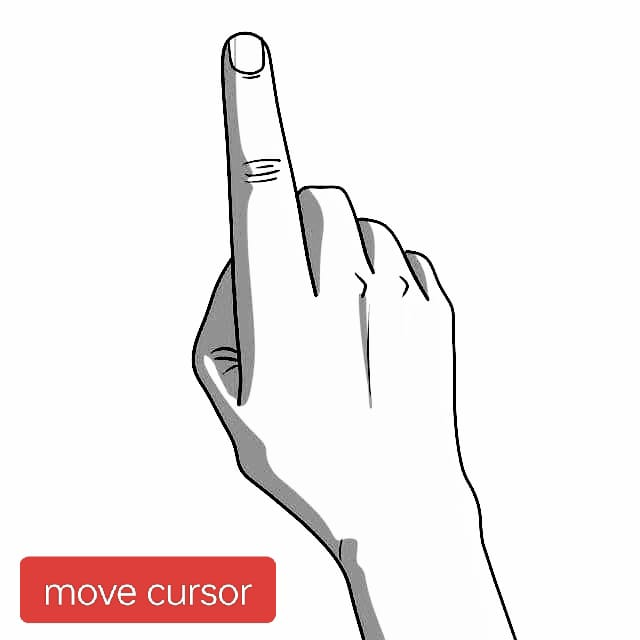
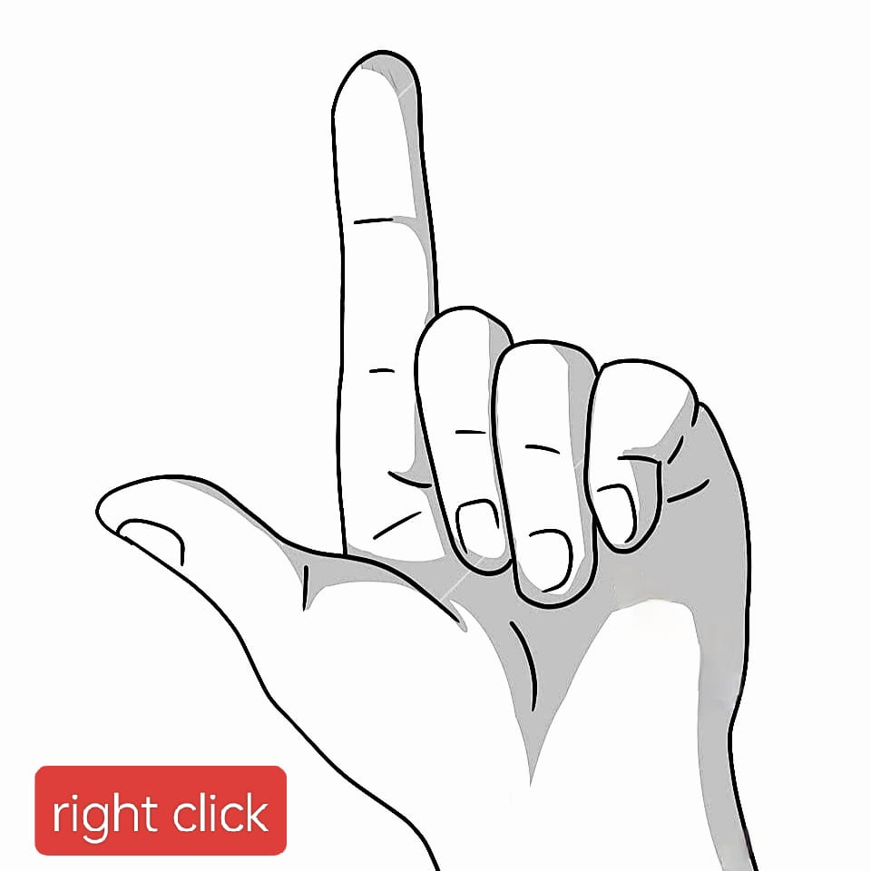
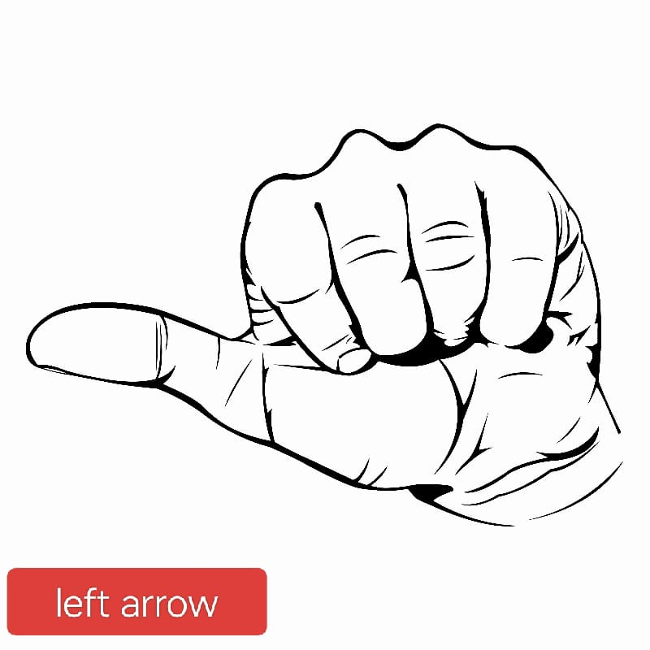
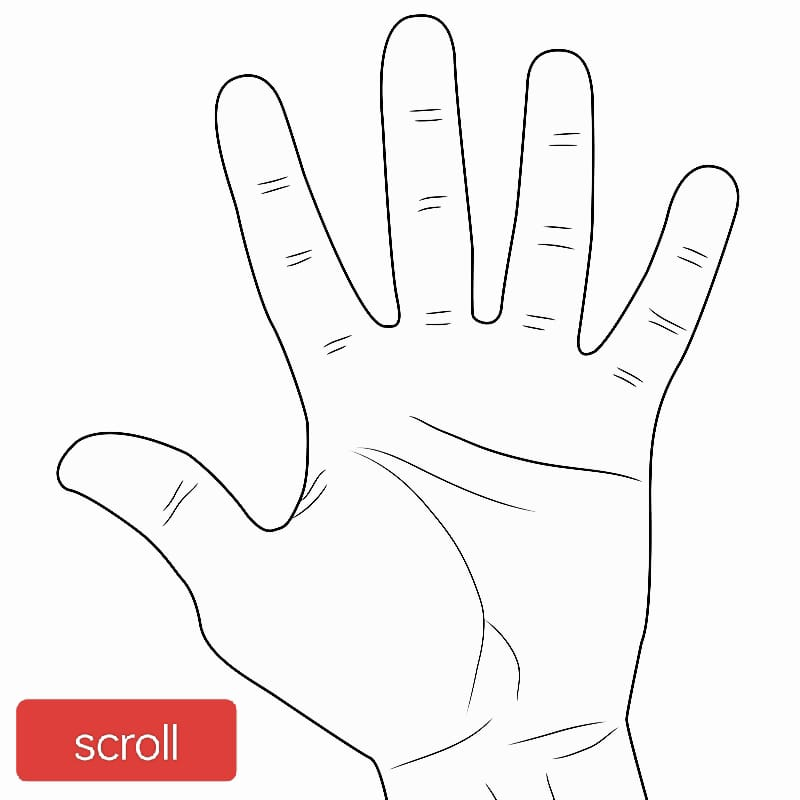
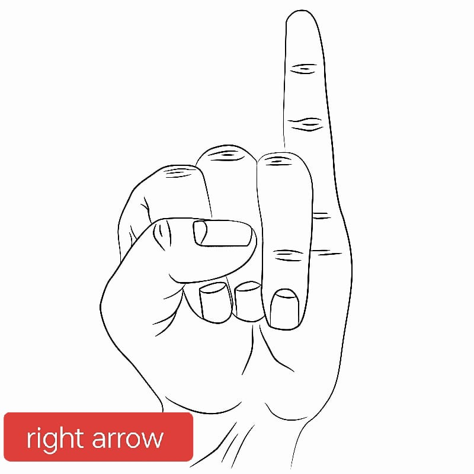
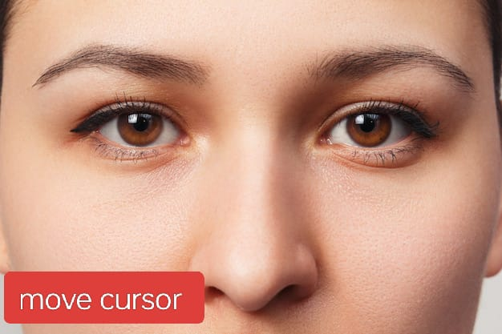
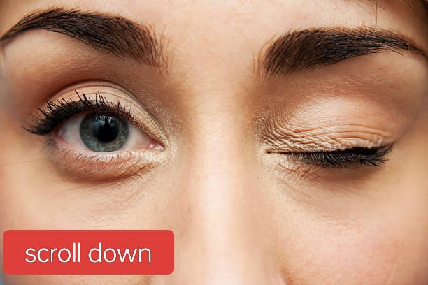

<h1 align="center" style="color:rgb(255, 255, 255); background-color: rgb(167, 48, 247); border-radius: 100px;">air-mouse-hand-and-face</h1>

In this project we will be using the live feed coming from the webcam to create a air mouse using hand and face
tracking.

## Dependencies

### OpenCV

OpenCV is a huge open-source library for computer vision, machine learning, and image processing. OpenCV supports a wide
variety of programming languages like Python, C++, Java, etc. It can process images and videos to identify objects,
faces, or even the handwriting of a human.

It can be installed using `pip install opencv-python`

### Mediapipe

MediaPipe is a framework for building multimodal (eg. video, audio, any time series data), cross platform (i.e Android,
iOS, web, edge devices) applied ML pipelines.

It can be installed using `pip install mediapipe`

### Autopy

AutoPy is a simple, cross-platform GUI automation library for Python. It includes functions for controlling the keyboard
and mouse, finding colors and bitmaps on-screen, and displaying alerts.

It can be installed using `pip install autopy`
<h1 align="center" style="color:coral">Setup</h1>
<h3>Dependencies</h2>

Run this command in project directory <code>pip install -r requirement.txt</code>

<h3>Run application</h3>
<code>streamlit run app.py</code>

<h1 align=center style="color:coral">Instruction</h1>
<!-- hand instruction section -->
<table style="width:100%">
    <h3 align=left>Hands</h3>
    <tr>
        <td align=center>
            
            
            
            
            
            
        </td>
    </tr>
</table>
<!-- 
 -->
<!-- face instruction section -->
<table>
    <h3 align=left>Face</h3>
    <tr class="face_instruction">
        <td class="face_instruction">
            
        </td>
        <td class="face_instruction">
            
<b style="font-size: 25px">Move cursor</b>

            
Distance between clent face and webcam should be less than <b>65cm</b>

        </td>
    </tr>
    <tr class="face_instruction">
        <td class="face_instruction">
            
        </td>
        <td class="face_instruction">
            
<b style="font-size: 25px">Left click</b>

            
Distance between clent face and webcam should be less than <b>75cm</b> with <b>left eye close</b>

        </td>
    </tr>
    <tr class="face_instruction">
        <td class="face_instruction">
            
        </td>
        <td class="face_instruction">
            
<b style="font-size: 25px">Right click</b>

            
Distance between clent face and webcam should be less than <b>75cm</b> with <b>right eye close</b>
            

        </td>
    </tr>
    <tr class="face_instruction">
        <td class="face_instruction">
            
        </td>
        <td class="face_instruction">
            
<b style="font-size: 25px">Scroll up</b>

            
Distance between clent face and webcam must be greater than <b>75cm</b> with <b>left eye close</b>
            

        </td>
    </tr>
    <tr class="face_instruction">
        <td class="face_instruction">
            
        </td>
        <td class="face_instruction">
            
<b style="font-size: 25px">Scroll down</b>

            
Distance between clent face and webcam must be greater than <b>75cm</b> with <b>right eye close</b>
            

        </td>
    </tr>
</table>